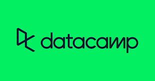

**Table of Contents**

- [Career Tracks](#career-tracks)
    * [Data Scientist with Python](#data-scientist-with-python)
    * [Data Scientist with R](#data-scientist-with-r)
    * Data Analyst in SQL
- [Skill Tracks](#skill-tracks)
    * [Python Fundamentals](#python-fundamentals)
    * [Data Manipulation with Python](#data-manipulation-with-python)
    * [Data Visualization with Python](#data-visualization-with-python)
    * [R Programming](#r-programming)
    * [Data Manipulation with R](#data-manipulation-with-r)
    * [Data Visualization with R](#data-visualization-with-r)
    * SQL Fundamentals

# Career Tracks

## Data Scientist with Python

1. [Introduction to Python](introduction-to-python)
1. [Intermediate Python](intermediate-python)
1. Investigating Netflix Movies and Guest Stars in The Office
1. [Data Manipulation with pandas](data-manipulation-with-pandas)
1. [Joining Data with pandas](joining-data-with-pandas)
1. [Introduction to Statistics in Python](introduction-to-statistics-in-python)
1. The GitHub History of the Scala Language
1. [Introduction to Data Visualization with Matplotlib](introduction-to-data-visualization-with-matplotlib)
1. [Introduction to Data Visualization with Seaborn](introduction-to-data-visualization-with-seaborn)
1. [Introduction to NumPy](introduction-to-numpy)
1. Python Data Science Toolbox (Part 1)
1. The Android App Market on Google Play
1. Python Data Science Toolbox (Part 2)
1. Intermediate Data Visualization with Seaborn
1. Data Communication Concepts
1. A Visual History of Nobel Prize Winners
1. Data Manipulation with Python
1. Introduction to Importing Data in Python
1. Intermediate Importing Data in Python
1. Cleaning Data in Python
1. Working with Dates and Times in Python
1. Importing &amp; Cleaning Data with Python
1. Writing Functions in Python
1. Python Programming
1. Exploratory Data Analysis in Python
1. Analyzing Police Activity with pandas
1. Introduction to Regression with statsmodels in Python
1. Sampling in Python
1. Hypothesis Testing in Python
1. Dr. Semmelweis and the Discovery of Handwashing
1. Supervised Learning with scikit-learn
1. Predicting Credit Card Approvals
1. Unsupervised Learning in Python
1. Machine Learning with Tree-Based Models in Python

## Data Scientist with R

1. [Introduction to R](introduction-to-r)
1. [Intermediate R](intermediate-r)
1. [Introduction to the Tidyverse](introduction-to-the-tidyverse)
1. [Data Manipulation with dplyr](data-manipulation-with-dplyr)
1. [Joining Data with dplyr](joining-data-with-dplyr)
1. [Introduction to Statistics in R](introduction-to-statistics-in-r)
1. [Introduction to Data Visualization with ggplot2](introduction-to-data-visualization-with-ggplot2)
1. [Intermediate Data Visualization with ggplot2](intermediate-data-visualization-with-ggplot2)
1. Data Communication Concepts
1. Introduction to Importing Data in R
1. Cleaning Data in R
1. Working with Dates and Times in R
1. Introduction to Writing Functions in R
1. Exploratory Data Analysis in R
1. Introduction to Regression in R
1. Intermediate Regression in R
1. Sampling in R
1. Hypothesis Testing in R
1. Experimental Design in R
1. Supervised Learning in R: Classification
1. Supervised Learning in R: Regression
1. Unsupervised Learning in R

# Skill Tracks

## Python Fundamentals

1. [Introduction to Python](introduction1.to1.python)
1. [Intermediate Python](intermediate1.python)
1. Python Data Science Toolbox (Part 1)
1. Python Data Science Toolbox (Part 2)

## Data Manipulation with Python

1. [Data Manipulation with pandas](data-manipulation-with-pandas)
1. Reshaping Data with pandas
1. Joining Data with pandas
1. Introduction to NumPy

## Data Visualization with Python

1. [Introduction to Data Visualization with Matplotlib](introduction-to-data-visualization-with-matplotlib)
1. [Introduction to Data Visualization with Seaborn](introduction-to-data-visualization-with-seaborn)
1. Improving Your Data Visualizations in Python
1. Visualizing Geospatial Data in Python

## R Programming

1. [Introduction to R](introduction-to-r)
1. [Intermediate R](intermediate-r)
1. Writing Efficient R Code
1. Introduction to Writing Functions in R
1. Object-Oriented Programming with S3 and R6 in R

## Data Manipulation with R

1. [Data Manipulation with dplyr](data-manipulation-with-dplyr)
1. Reshaping Data with tidyr
1. Joining Data with dplyr
1. Case Study: Exploratory Data Analysis in R

## Data Visualization with R

1. [Introduction to Data Visualization with ggplot2](introduction-to-data-visualization-with-ggplot2)
1. [Intermediate Data Visualization with ggplot2](intermediate-data-visualization-with-ggplot2)
1. Visualization Best Practices in R
